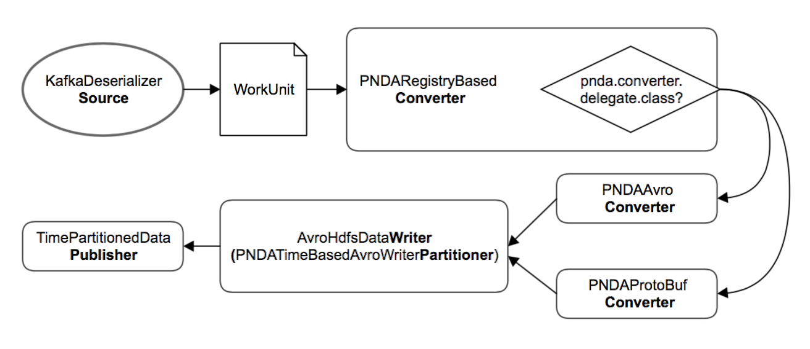

# platform-gobblin-modules

This repo contains the [gobblin modules](https://gobblin.readthedocs.io/en/latest/developer-guide/GobblinModules/) which allow to customize the gobblin-distribution build for PNDA.

This module adds the following classes:

| Class                                             | Module        | Description                             |
|---------------------------------------------------|---------------|-----------------------------------------|
| gobblin.pnda.PNDARegistryBasedConverter           | [Converter](https://gobblin.readthedocs.io/en/latest/Gobblin-Architecture/#converter)     | 
| gobblin.pnda.PNDAAvroConverter                    | [Converter](https://gobblin.readthedocs.io/en/latest/Gobblin-Architecture/#converter)     | 
| gobblin.pnda.PNDAProtoBufConverter                | [Converter](https://gobblin.readthedocs.io/en/latest/Gobblin-Architecture/#converter)     | 
| gobblin.pnda.AvroDataWriterBuilder                | [Writer](https://gobblin.readthedocs.io/en/latest/Gobblin-Architecture/#data-writer)
| gobblin.pnda.PNDATimeBasedAvroWriterPartitioner   | [Writer](https://gobblin.readthedocs.io/en/latest/Gobblin-Architecture/#data-writer)
| gobblin.publisher.TimePartitionedDataPublisher    | [Publisher](https://gobblin.readthedocs.io/en/latest/Gobblin-Architecture/#data-publisher)

The converter can only work with a Kafka-compatible source. The flow below gives an overview on the Gobblin constructs that constitute the task flows in the PNDA Gobblin job.

